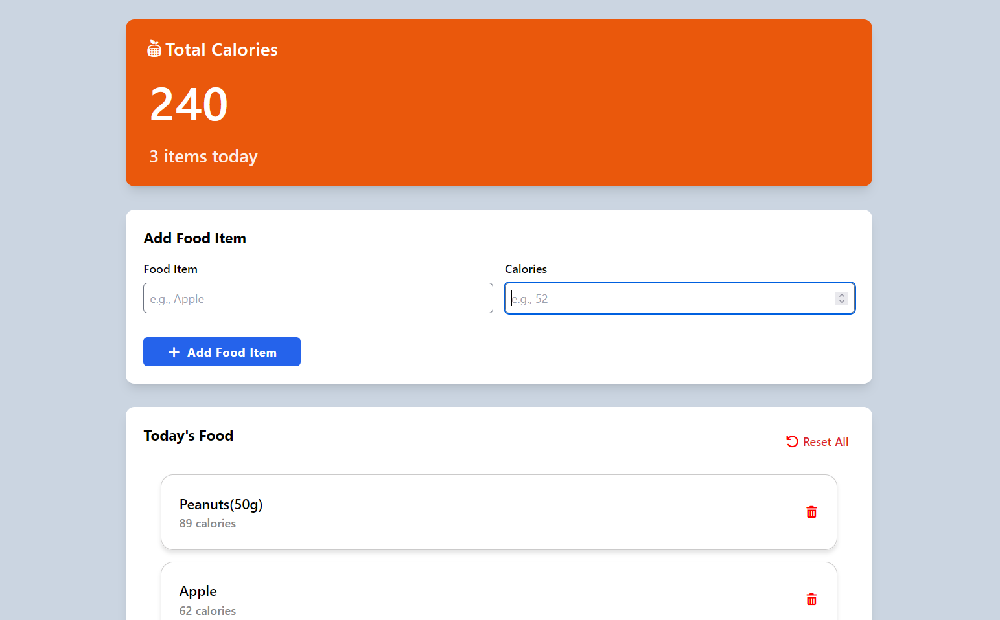

# Calorie Counter App

This project is an interactive calorie web application built using HTML, Javascript, Tailwind CSS, and localStorage. The application allows users to log daily food items, automatically calculates total calorie intake, tracks the number of item consumed, and persists data across sessions.

## Contributor

Isaac Ndungu

## Project Brief
The primary objective of this project is to build a calorie tracking application that enables users to log food items and monitor daily calorie consumption in a structured way.

### Key Features 

- Add Food Items - Users can enter a food name and calorie value
- Automatic Total Calorie Calculation - The application computes the total calories based on stored food items to ensure accurate real-time updates.
- Daily Item Counter - The application calculates the number of food entries.
- Persistent Storage - All food items are stored in localStorage.
- Delete Functionality - The application includes a delete icon for each food item.
- Reset Functionality - The user can reset the tracker for a fresh start each day.

## Screenshot 
 

## Technologies Used 
- HTML5
- CSS3
- Tailwind CSS
- Javascript
- localStorage

## Live Link

[Visit my website](https://isaac-ndungu.github.io/calorie-counter-app/)

## Usage Instructions
1. Clone the repository:
```bash
git clone git@github.com:isaac-ndungu/calorie-counter-app.git
```
2. Open the project folder
3. Open `index.html` in any modern web browser

## Known Bugs
There are no known bugs.

## Support and Contact Information

Email: isaacndungu478@gmail.com 

## License

MIT Licence 